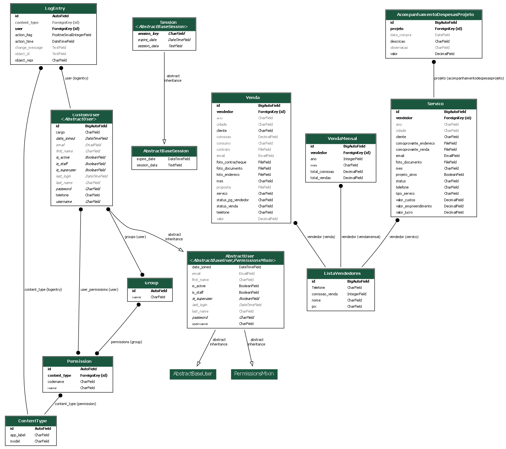

# Caoa Engenharia
### Projeto de gestão de uma empresa de energia solar.

Sistema criado para gerir e acompanhar os serviços realizados pela empresa, incluindo
orçamentos e acompanhamento de custos de projeto a projeto.

####projeto tem processamento LM para gerar orçamentos, realizado um pre orçamento,
com base no banco de dados.

Projeto desenvolvido em Python, framework Django.

Para rodar o projeto instale as dependencias.
`````bash
pip install -r requirements.txt
`````

Arquivo requirements totalmente atualizados.

Rode as migrações do projeto.
`````bash
python manage.py migrate
`````

banco de dados utilizado neste projeto foi o Postegresql


projeto rodando em docker.
`````bash
docker-compose up --build
`````

